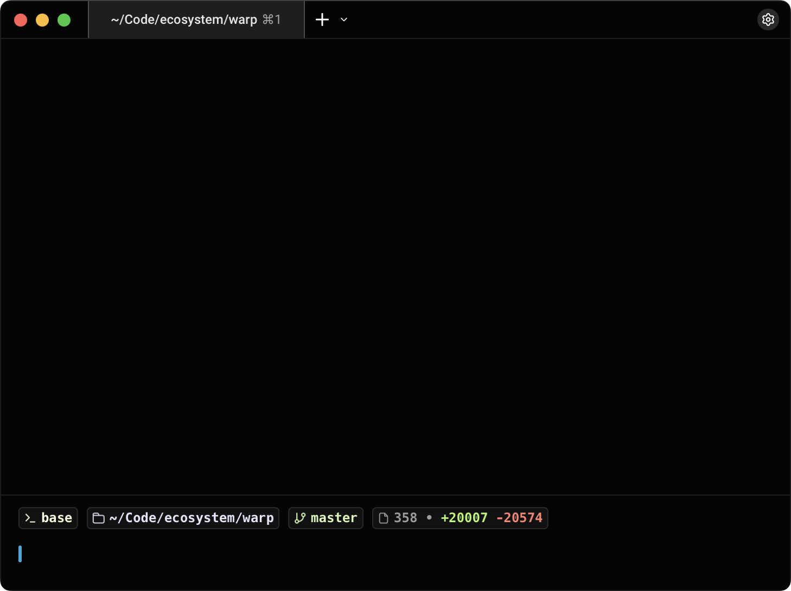
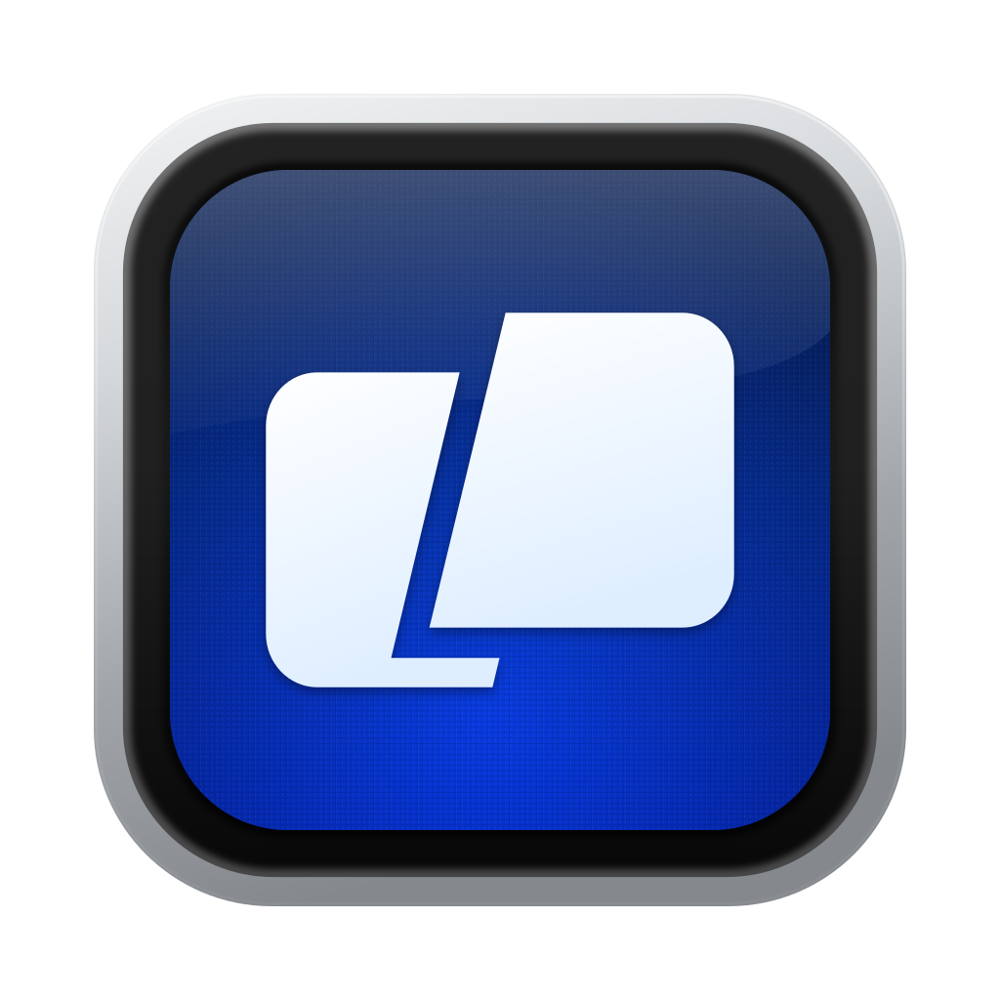
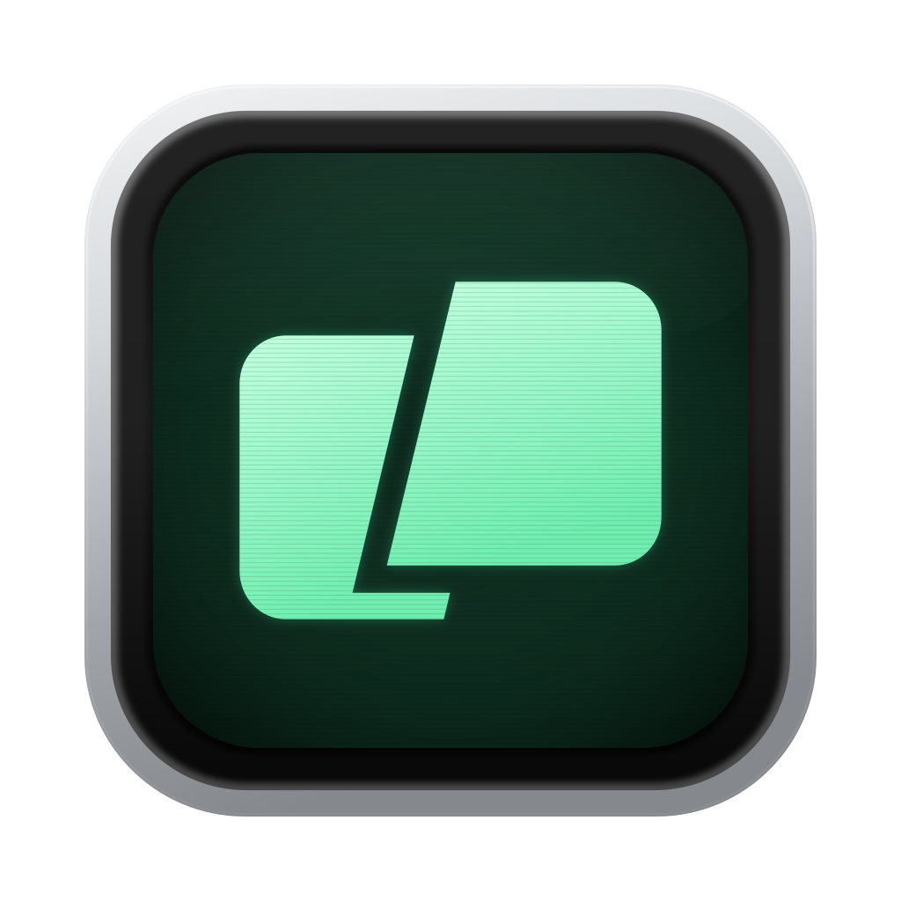

# Warp Local

A terminal with less in the way. This fork of Warp strips out the built-in AI experience and Warp’s remote cloud services to focus on a lighter, simpler terminal for everyday development. Local shells take center stage, with a pared-back interface and custom CRT icons that give the app its own identity.

- **Terminal first.** Local commands, tabs, and panes, with a focused interface.
- **Less overhead.** Built-in AI, cloud agents, account flows, cloud sync, and telemetry are disabled in the local build.
- **Your tools still fit.** Run your own command-line tools and connect to machines over SSH.
- **A look of its own.** Choose from three custom CRT app icons in Settings → Appearance → Icon.

<table>
  <tr>
    <td align="center"> <strong>CRT Blue</strong></td>
    <td align="center"> <strong>CRT Green</strong></td>
    <td align="center"> <strong>CRT Amber</strong></td>
  </tr>
</table>

[Icon artwork and exports](design/icon/README.md) · [Build and development instructions](AGENTS.md) · [Original upstream README](README.upstream.md)

Based on [Warp](https://github.com/warpdotdev/warp). The UI framework is licensed under [MIT](LICENSE-MIT); the rest of the code is licensed under [AGPL v3](LICENSE-AGPL).
